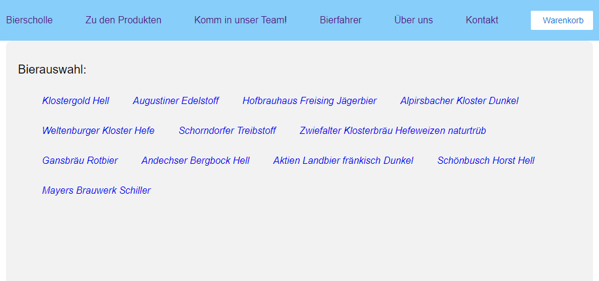
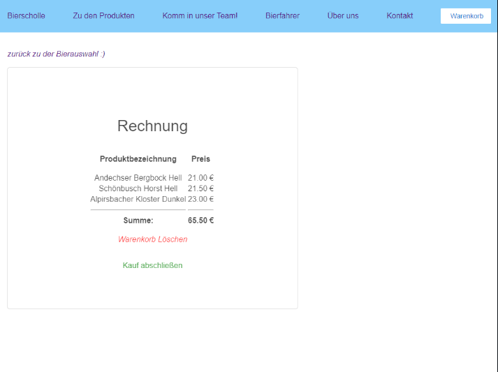
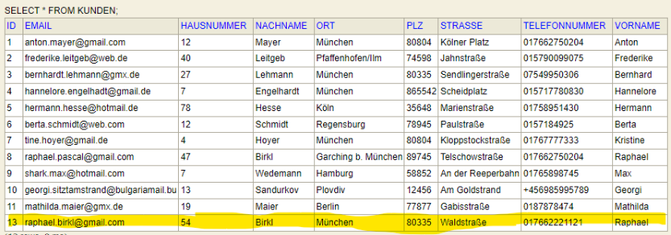

# Bierscholle 

### Bierscholle is an Online Shop created within the 4 month Java-Course. The shop is selling beer and uses REST to transfer data between the UI and an H2 Development Database. 
### Four students of the AW-Akademie have participated in this project.

### This Project contains two frameworks (Spring and Angular). To get the frontend running type "npm install" in the console (when you're in the frontend directory). For the backend you'll have to allow the annotation processing (Lombok). 

## Landing Page - Greet the happy penguin

## Product Page - Choose the article of your choice 

## Product Details - Further information about your choice

## Shopping Cart - Just fill it :)

## Give us your data - We won't sell it

## Thanks for your order

## You need a job? - Take a look at our vacancies

## Want to give us feedback? 

## We keep track of our  data

## If you want to learn more about us

